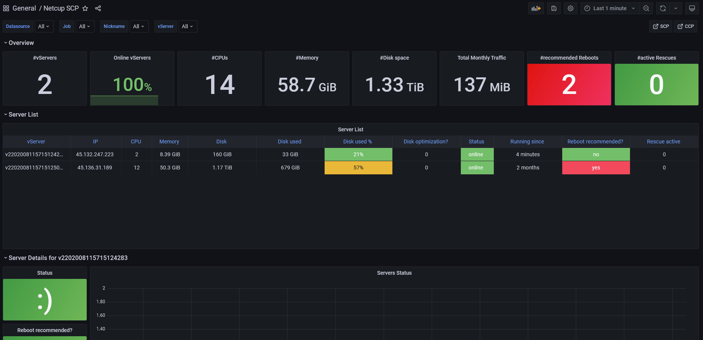

# netcupscp-exporter
Prometheus Exporter for [Netcup ServerControlPanel (SCP) WebService](https://www.netcup-wiki.de/wiki/Netcup_SCP_Webservice) to provide external visibility into server state.

> [!NOTE]
> As per Netcup support, be aware that they do not provide support for their own API.
> Endpoints might change or break suddenly.
> Due to the limited documentation, this exporter makes a couple of assumptions when interpreting the responses of the API.
> Therefore, treat any values you get with caution.
> This repository is not affiliated with Netcup.

## Usage
* Generate a Refresh Token:

    You can use the provided helper script:
    ```bash
    ./get-refresh-token.sh
    ```

* Use the `refresh_token` from the response for this exporter.

### Token Management and Revocation
Netcup uses Keycloak for authentication. You can manage your applications and revoke refresh tokens in the Account Console:

[https://www.servercontrolpanel.de/realms/scp/account/](https://www.servercontrolpanel.de/realms/scp/account/)

To revoke access, go to the **Applications** menu, find the **scp** application, and click **Remove access**.

### Refreshing the Access Token
The refresh token can be used multiple times and does not expire as long as it is used at least once every 30 days. To manually generate a new access token:

```bash
curl 'https://www.servercontrolpanel.de/realms/scp/protocol/openid-connect/token' \
  -d 'client_id=scp'\
  -d 'refresh_token=<refresh_token>' \
  -d 'grant_type=refresh_token'
```

```bash
./netcupscp-exporter --refresh-token TOKEN
```

Default port: 9757

### Helm Chart

A Helm Chart is available [here](https://github.com/christianknell/helm-charts/tree/main/charts/netcupscp-exporter).

### Grafana

A Grafana dashboard is available [here](https://grafana.com/grafana/dashboards/16705).



## Metrics

```
# HELP scp_build_info A metric with a constant '1' value labeled by version, revision, branch, and goversion from which scp was built.
# TYPE scp_build_info gauge
scp_build_info{branch="",goversion="go1.17.5",revision="71a8595111dd83c45d9c0dd1e7d4418fc9f6928a",version="v0.1.0"} 1
# HELP scp_cpu_cores Number of CPU cores
# TYPE scp_cpu_cores gauge
scp_cpu_cores{vserver="servername"} 4
# HELP scp_cpu_max_count Maximum number of CPU cores
# TYPE scp_cpu_max_count gauge
scp_cpu_max_count{vserver="servername"} 16
# HELP scp_autostart_enabled Autostart enabled (1) / disabled (0)
# TYPE scp_autostart_enabled gauge
scp_autostart_enabled{vserver="servername"} 1
# HELP scp_config_changed Pending configuration changes (1) / none (0)
# TYPE scp_config_changed gauge
scp_config_changed{vserver="servername"} 0
# HELP scp_disabled Server is disabled (1) / enabled (0)
# TYPE scp_disabled gauge
scp_disabled{vserver="servername"} 0
# HELP scp_disk_capacity_bytes Available storage space in Bytes
# TYPE scp_disk_capacity_bytes gauge
scp_disk_capacity_bytes{driver="scsi",name="vda",vserver="servername"} 3.4359738368e+11
# HELP scp_disk_optimization Optimization recommended (1) / not recommended (0)
# TYPE scp_disk_optimization gauge
scp_disk_optimization{driver="scsi",message="",name="vda",vserver="servername"} 0
# HELP scp_disk_used_bytes Used storage space in Bytes
# TYPE scp_disk_used_bytes gauge
scp_disk_used_bytes{driver="scsi",name="vda",vserver="servername"} 3.221225472e+09
# HELP scp_disks_available_space_bytes Available space for new disks in Bytes
# TYPE scp_disks_available_space_bytes gauge
scp_disks_available_space_bytes{vserver="servername"} 0
# HELP scp_interface_speed_mbits Interface link speed in Mbits/s
# TYPE scp_interface_speed_mbits gauge
scp_interface_speed_mbits{driver="virtio",mac="aa:bb:cc:dd:ee:ff",vserver="servername"} 1000
# HELP scp_interface_throttled Interface's traffic is throttled (1) or not (0)
# TYPE scp_interface_throttled gauge
scp_interface_throttled{driver="virtio",id="iface_id",ip="1.2.3.4",ip_type="ipv4",mac="aa:bb:cc:dd:ee:ff",throttle_message="",vserver="servername"} 0
scp_interface_throttled{driver="virtio",id="iface_id",ip="1:2:3:4::/64",ip_type="ipv6",mac="aa:bb:cc:dd:ee:ff",throttle_message="",vserver="servername"} 0
# HELP scp_ip_info IPs assigned to this server
# TYPE scp_ip_info gauge
scp_ip_info{ip="1.2.3.4",vserver="servername"} 1
scp_ip_info{ip="1:2:3:4::",vserver="servername"} 1
# HELP scp_latest_qemu Server is running latest QEMU version (1) / older (0)
# TYPE scp_latest_qemu gauge
scp_latest_qemu{vserver="servername"} 1
# HELP scp_memory_bytes Amount of Memory in Bytes
# TYPE scp_memory_bytes gauge
scp_memory_bytes{vserver="servername"} 1.8013487104e+10
# HELP scp_memory_max_bytes Maximum amount of Memory in Bytes
# TYPE scp_memory_max_bytes gauge
scp_memory_max_bytes{vserver="servername"} 1.8013487104e+10
# HELP scp_monthlytraffic_in_bytes Monthly traffic incoming in Bytes (only gigabyte-level resolution)
# TYPE scp_monthlytraffic_in_bytes gauge
scp_monthlytraffic_in_bytes{month="1",vserver="servername",year="2022"} 2.097152e+06
# HELP scp_monthlytraffic_out_bytes Monthly traffic outgoing in Bytes (only gigabyte-level resolution)
# TYPE scp_monthlytraffic_out_bytes gauge
scp_monthlytraffic_out_bytes{month="1",vserver="servername",year="2022"} 0
# HELP scp_monthlytraffic_total_bytes Total monthly traffic in Bytes (only gigabyte-level resolution)
# TYPE scp_monthlytraffic_total_bytes gauge
scp_monthlytraffic_total_bytes{month="1",vserver="servername",year="2022"} 2.097152e+06
# HELP scp_rescue_active Rescue system active (1) / inactive (0)
# TYPE scp_rescue_active gauge
scp_rescue_active{message="",vserver="servername"} 0
# HELP scp_server_start_time_seconds Start time of the vserver in seconds (only minute-level resolution)
# TYPE scp_server_start_time_seconds gauge
scp_server_start_time_seconds{vserver="servername"} 1.64047511e+09
# HELP scp_server_status Online (1) / Offline (0) status
# TYPE scp_server_status gauge
scp_server_status{architecture="AMD64",nickname="nick1",site_city="Nuremberg",status="online",vserver="servername"} 1
# HELP scp_snapshot_allowed Snapshot creation allowed (1) / disallowed (0)
# TYPE scp_snapshot_allowed gauge
scp_snapshot_allowed{vserver="servername"} 1
# HELP scp_snapshot_count Total number of snapshots
# TYPE scp_snapshot_count gauge
scp_snapshot_count{vserver="servername"} 0
# HELP scp_uefi_enabled UEFI enabled (1) / disabled (0)
# TYPE scp_uefi_enabled gauge
scp_uefi_enabled{vserver="servername"} 1
```

## Build

To build the binary locally:
```bash
go build -o netcupscp-exporter .
```

Alternatively, you can use [GoReleaser](https://goreleaser.com/) to build for all supported platforms:
```bash
goreleaser build --clean --snapshot
```

## Maintenance
### Generating the REST API client
The client is generated by [oapi-codegen](https://github.com/oapi-codegen/oapi-codegen).

The OpenAPI specification can be fetched from `https://www.servercontrolpanel.de/scp-core/api/v1/openapi`.

```bash
curl -s https://www.servercontrolpanel.de/scp-core/api/v1/openapi -o openapi.json
go tool oapi-codegen -config oapi-codegen-config.yaml openapi.json
```

